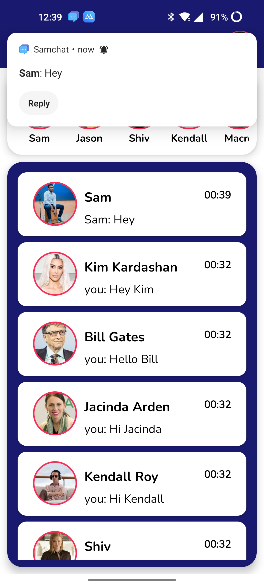

###    CHAT MESSENGER | Firebase | MVVM | FCM | Navigation | Retrofit | Kotlin Coroutines | 
####   Développé par les développeurs Ebanga Loic et Nsea Bonaventure © 2023
####   Ecrit moi ebangaarnaud@gmail.com


#### Caractéristiques 
1. Firebase Cloud Messaging (FCM) et mise à niveau pour les notifications push
2. Restauration de feu 
3. Composant de navigation 
4. Liaison de données bidirectionnelle
5. Architecture MVVM 
6. Coroutines Kotlin 
7. Stockage Firebase


#### Structure de la base du projet

Messages:
```
Collection : Messages 
   Document : chatroomid 
       Collection : chats
         Document : Horodatage
         
Pour Chatroomid : généré un identifiant unique en utilisant la fonction de tri pour joindre l’identifiant de l’expéditeur et celui du destinataire. L’ordre de l’identifiant unique sera conservé quel que soit l’expéditeur ou le destinataire lors de l’ajout du document à la collection
       
```


#### Images 

#### Écran de connexion 

<div style="display: flex; flex-direction: row;">
  
</div>


#### Écran d’accueil

<div style="display: flex; flex-direction: row;">
  
</div>


#### Écran de chat en tête-à-tête

<div style="display: flex; flex-direction: row;">
  
</div>


#### Écran de réglage

<div style="display: flex; flex-direction: row;">
  
  

</div>


#### Notifications

<div style="display: flex; flex-direction: row;">
  
  
</div>


##### Merci!!!!
